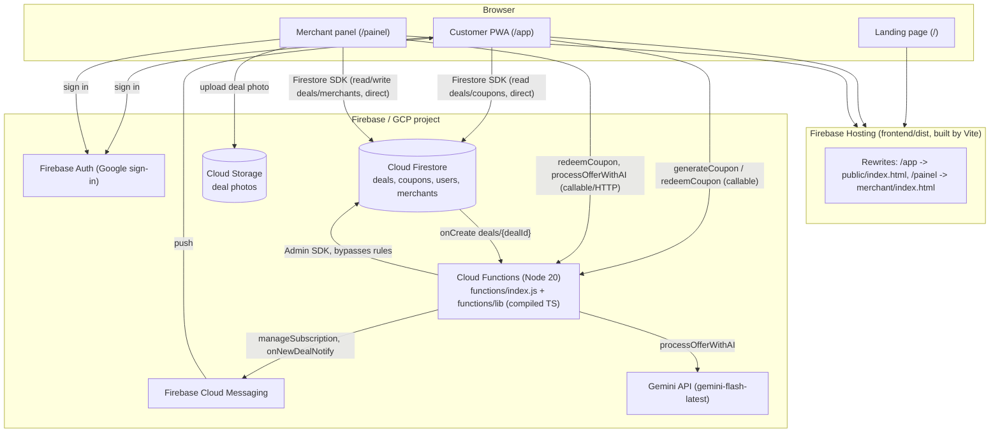
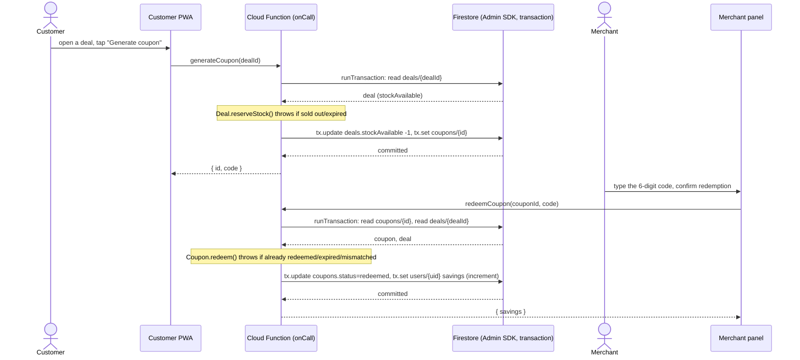
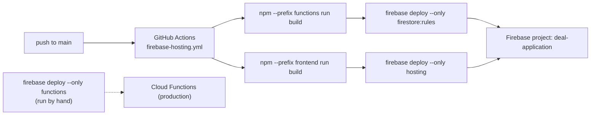

# Architecture Review — Radar da Oferta (dealapp)

Status: **all 8 findings fixed** — see the note at the top of each finding below and the roadmap at
the end of this document for what changed and where.
Scope: `frontend/public/` (customer PWA), `frontend/merchant/` (merchant panel), `functions/` (Cloud
Functions), Firestore/Storage security configuration, CI.

This document records the findings from an initial architectural pass, the reasoning behind each
recommendation, and a phased roadmap the team has agreed to. It is meant to be read before touching
the coupon/deal/stock flows or the Cloud Functions entry point, since several of the findings are not
visible from reading any single file in isolation.

**A note on paths below:** each finding's `**Where:**`/body section describes the bug as it was found,
at the time it was found — several predate two later moves (root `public/`/`merchant/` into
`frontend/public/`/`frontend/merchant/`, then `.js` into `.ts`). Those historical paths are left
unchanged on purpose; the `> **Resolved.**` blockquote at the top of each finding always reflects the
current, real location and extension. When in doubt, the code is the source of truth, not this
document — grep for the function/file name if a referenced path no longer exists.

## Architecture overview

Three static surfaces built by one Vite project (`frontend/`) and served by Firebase Hosting from
`frontend/dist`, plus one Cloud Functions deployment. No server process to operate beyond Functions;
no message queue, no container orchestration.



**Why direct client reads are safe here:** customer/merchant reads of `deals`/`coupons`/`merchants`
go straight from the browser SDK to Firestore, governed by `firestore.rules` — there is no API layer
in front of reads. Only *mutations* that must preserve an invariant (stock decrement, coupon
redemption) go through a Cloud Function; everything else would just be an extra network hop with no
correctness benefit (see Finding 1 for why coupon/stock specifically needed to move server-side).

### Coupon generation and redemption (the one flow that must never race)



Both transactions are exercised under real concurrency in
`functions/test/integration/couponService.emulator.test.ts` (two simultaneous `generateCoupon` calls
against 1 unit of stock; two simultaneous `redeemCoupon` calls on the same coupon) — this is the
guarantee Finding 1 is about, not just "it works in the happy path."

### Deploy flow



Neither `BuildFn` nor `BuildFe` run the projects' test suites — CI builds and deploys on every green
build, not on green tests. See "Known limitations" in the roadmap below.

## Executive summary

| # | Finding | Severity | Category | Status |
|---|---|---|---|---|
| 1 | Stock/coupon mutation is client-authoritative with no real transaction | P0 | Correctness / trust boundary | **Fixed** |
| 2 | The only transactional, server-side coupon logic exists but is never deployed | P0 | Dead code / architectural drift | **Fixed** |
| 3 | Firestore rules and indexes exist in two diverging copies; only one is live | P0 | Configuration risk | **Fixed** |
| 4 | Domain model is anemic; business rules live inline in DOM-manipulating code | P1 | DDD violation | **Fixed** (`functions/src/domain/`; client-side duplication consolidated into `frontend/shared/domain/`, see roadmap step 6) |
| 5 | Both frontends have no build pipeline, no TypeScript, no test runner | P1 | TDD enabler / foundational | **Fixed** |
| 6 | Geo-proximity data (`geohash`) is written but never queried; declared dependency unused | P2 | Dead data modeling | **Fixed** |
| 7 | No test suite anywhere in the repository | P1 | TDD enabler | **Fixed** |
| 8 | Storage rules allow any authenticated user to write to any path | P2 | Security hardening | **Fixed** |

Findings 1 and 2 are two faces of the same problem and should be fixed together: the codebase already
contains the correct fix, it is simply not wired into what actually runs in production.

---

## Finding 1 — Stock/coupon mutation is client-authoritative

> **Resolved.** `public/js/coupons.js::generateCoupon` and `merchant/js/coupons.js::confirmRedemption`
> now call the `generateCoupon`/`redeemCoupon` Cloud Functions instead of writing to Firestore
> directly. See Finding 2 for the implementation, and `firestore.rules` for the tightened rules
> (client can no longer write `coupons` or decrement `deals.stockAvailable`). The description below is
> kept as the historical record of the bug found.

**Where:** `public/js/coupons.js` (`generateCoupon`, lines 18–86); the primary (active) path in
`merchant/js/coupons.js` above `confirmRedemptionCloudFunction`.

**What happens today:** the browser reads the `deals` document, checks `stockAvailable` and
`expiresAt` client-side, generates a coupon code with `Math.random()`, then performs two independent
writes — `addDoc` on `coupons` and `updateDoc({ stockAvailable: increment(-1) })` on `deals` — with no
`runTransaction` wrapping them. Firestore security rules only constrain the *shape* of each write in
isolation:

```
// firestore.rules
match /deals/{dealId} {
  allow update: if isAuthenticated() &&
                   (resource.data.merchantId == request.auth.uid ||
                    request.resource.data.stockAvailable == resource.data.stockAvailable - 1);
}
match /coupons/{couponId} {
  allow create: if isAuthenticated() && request.resource.data.userId == request.auth.uid;
}
```

Neither rule references the other collection. A client can decrement `stockAvailable` without ever
creating a coupon, create a coupon without decrementing stock, or two concurrent requests can both
read `stockAvailable: 1`, both pass the rule (each computes `1 - 1 = 0` independently), and both
succeed — overselling stock. There is also no server-side verification that the six-digit code is
unique or that the deal was actually still active at write time beyond the client's own (spoofable)
read.

**Why this matters (technical justification):** stock and coupon issuance are exactly the kind of
invariant DDD calls an *aggregate boundary* — "a coupon may only exist if stock was atomically
decremented for it" must be enforced by a single transactional writer, not by two rules that each see
half the picture. Firestore security rules can express cross-document invariants (via `get()`/`exists()`
inside the rule, or by denying direct writes to derived fields entirely), but the robust way to do this
is a single server-side transaction that is the *only* writer of `stockAvailable`.

**Recommendation:** move coupon issuance and redemption to be server-authoritative:
- The client calls a Cloud Function (see Finding 2 — this already exists in `functions/src/index.ts`
  and just needs to be the thing that actually deploys).
- Firestore rules stop allowing direct client writes to `stockAvailable` and to `coupons.status`; only
  the Functions service account (via Admin SDK, which bypasses rules) may write them.
- The function wraps the stock check + decrement + coupon creation in `admin.firestore().runTransaction`.

**Trade-offs:**
- *Benefit:* correctness — no overselling, no forged coupons, single source of truth for the invariant.
- *Cost:* one network round-trip through a callable function instead of an optimistic local write; the
  UI needs a loading state it may not have today. This is a small UX cost relative to the correctness
  gained, and the app already does a Firestore read before writing, so the perceived latency delta is
  modest.
- *Complexity:* low — the transactional logic already exists (Finding 2), this is largely a wiring and
  rules-tightening change, not new design.

**When it would *not* be worth it:** if stock/coupon counts were purely cosmetic (no real scarcity or
fraud concern). They are not here — stock is a real constraint tied to a physical, single-redemption
coupon, so server-side enforcement is warranted, not over-engineering.

---

## Finding 2 — The correct server-side implementation exists but never deploys

> **Resolved.** The old `functions/src/index.ts` (with the bugs described below — read-outside-
> transaction, non-transactional `redeemCoupon`, mismatched returned coupon id) was replaced, not
> reused as-is. New implementation: `functions/src/domain/{Deal,Coupon,couponCode}.ts` (pure domain
> logic, unit-tested), `functions/src/application/couponService.ts` (the real
> `db.runTransaction(...)` orchestration, integration-tested against the Firestore Emulator),
> `functions/src/callable/coupons.ts` (the `onCall` wrappers). `createDeal`/`updateStock` were dropped,
> not ported (see the roadmap note at the end of this finding). `functions/index.js` now requires and
> re-exports the compiled `generateCoupon`/`redeemCoupon`. The description below is kept as the
> historical record of what was found.

**Where:** `functions/src/index.ts` (compiles to `functions/lib/index.js`, gitignored) vs.
`functions/index.js` (plain JS, the real entry point).

`functions/package.json` sets `"main": "index.js"`. `functions/index.js` requires only
`firebase-functions`, `firebase-admin`, `firebase-functions/v2/https`, `firebase-functions/logger`, and
`@google/generative-ai` — it never requires anything from `./lib`. Meanwhile `functions/src/index.ts`
defines `generateCoupon`, `redeemCoupon`, `createDeal`, and `updateStock`, each using
`admin.firestore().runTransaction` correctly. None of these four functions are ever registered with
Cloud Functions, because nothing imports `lib/index.js`'s exports into `index.js`.

This is confirmed by `merchant/js/coupons.js`: it defines an *active* redemption path (direct Firestore
writes, reached by the real UI) and a second, unreferenced function
`window.confirmRedemptionCloudFunction` that calls `httpsCallable(functions, 'redeemCoupon')` — a
function name that, per the above, does not exist in the deployed Functions. If anything ever called
this path, it would fail at runtime with "function not found."

**Why this matters:** this is architectural drift — a past migration to TypeScript/Cloud Functions was
started, is functionally correct, and was silently abandoned in favor of client-side writes, without
removing the dead code. Anyone reading `functions/src/*` today reasonably assumes it is what runs in
production; it is not. This is exactly the kind of non-obvious risk that costs real debugging time.

**Recommendation:** pick one source of truth and delete the other.
- Given Finding 1's remediation requires exactly this transactional logic, **promote
  `functions/src/index.ts` to be the deployed code**: either point `functions/package.json`'s `main`
  at the compiled output (with `build` actually running `tsc`, unlike today's no-op script), or port
  `functions/index.js`'s currently-deployed functions (`processOfferWithAI`, `manageSubscription`,
  `onNewDealNotify`, `testNotification`, `checkTopicStatus`, `debugTokenInfo`) into the TypeScript
  source tree and retire `functions/index.js` entirely.
- Delete the dead `window.confirmRedemptionCloudFunction` path in `merchant/js/coupons.js` once the
  real redemption flow is server-authoritative (it becomes the *only* path, not a second one).

**Trade-offs:** consolidating to a single TypeScript entry point costs one afternoon of careful,
test-covered migration (see the P0/P1 roadmap below) but removes an entire class of "which file is
real" confusion for every future change to Functions.

**What actually shipped (see resolution note above):** `functions/index.js` keeps the six original
JS exports untouched and additionally requires the compiled `generateCoupon`/`redeemCoupon` from
`functions/lib/callable/coupons.js` — a smaller, lower-risk change than a full migration of the six
stable functions to TypeScript, which remains open as tech debt. `createDeal`/`updateStock` were not
ported: they were unused by any client, had no real admin check (just a `// TODO`), and `createDeal`'s
shape didn't match what `merchant/js/deals.js::createDeal()` actually writes (missing
`merchantLocation`, `geohash`, etc.). Revisit as separately scoped work if server-authoritative deal
creation is ever needed. `window.confirmRedemptionCloudFunction` (the dead duplicate path) was deleted.

---

## Finding 3 — Firestore rules/indexes exist in two diverging copies

> **Resolved.** The stale `firestore/` directory was deleted and `docs/setup.md` now points at the
> root files.

**Where:** `firestore.rules` / `firestore.indexes.json` (repo root) vs. `firestore/firestore.rules` /
`firestore/firestore.indexes.json`.

`firebase.json` points `firestore.rules`/`firestore.indexes.json` at the **root** files, and
`.github/workflows/firebase-hosting.yml` deploys rules from that same root path on every push to
`main`. The `firestore/` copies are not referenced by any config and are never deployed — yet they
contain materially different rules (e.g. a more restrictive `users` read rule, a different
`merchants` write rule) and `docs/setup.md` explicitly instructs readers to edit the *unused* copy:

```
### 4. Configurar Firestore
As regras e índices já estão configurados em:
- `firestore/firestore.rules`
- `firestore/firestore.indexes.json`
```

**Why this matters:** a developer who "tightens" `firestore/firestore.rules` in response to a security
review will believe production is now safer when nothing changed. This is a live foot-gun.

**Recommendation:** delete the `firestore/` copies (or, if they represent an intended future rule set,
make that explicit and diff it against root before ever adopting it), and fix `docs/setup.md` to point
at the root files.

**Trade-offs:** none of substance — this is pure cleanup with no functional cost.

---

## Finding 4 — Anemic domain model

> **Resolved for the coupon/stock invariants covered by Findings 1-2**, specifically:
> `functions/src/domain/Deal.ts` (`reserveStock()`, `isExpired()`, `savings()`) and
> `functions/src/domain/Coupon.ts` (`canBeRedeemedBy()`, `redeem()`), both unit-tested in isolation.
> `functions/src/models/{Coupon,Deal}.ts` remain as plain DTOs for the Firestore persistence shape —
> the split is intentional (see recommendation below). The client-side status derivation in
> `public/js/coupons.js` (`getStatusLogic`) is display-only logic (labelling a coupon as
> active/urgent for the UI) and was left as-is; it does not enforce any invariant the server doesn't
> already enforce independently.

**Where:** `functions/src/models/Coupon.ts`, `functions/src/models/Deal.ts` (plain data interfaces,
no behavior); business rules duplicated inline in `public/js/coupons.js` (`getStatusLogic`, lines
139–153) and scattered across `deals.js` in both `public/` and `merchant/`.

Status derivation (`active` / `urgent` / `expired` / `redeemed`), stock/expiry validation, and discount
computation are implemented as free functions mixed into UI code, with no single place that owns "what
makes a coupon valid" or "what makes a deal purchasable." The TypeScript models are DTOs, not
aggregates — they carry no invariants or behavior of their own.

**Recommendation:** once Finding 2 lands (TypeScript is the deployed Functions runtime), introduce
`Coupon` and `Deal` as small domain classes with the invariants as methods (`Coupon.redeem()`,
`Deal.reserveStock()`), used by the Cloud Function application layer. Do **not** attempt this in the
two frontends until Finding 5's build pipeline exists — there is no way to share a domain class between
a TypeScript Cloud Function and an unbundled browser ES module today.

**Trade-offs:** this is the highest-value, lowest-risk DDD investment in the codebase, because
TypeScript and a package boundary already exist in `functions/`. Doing it here first — before the
frontends — avoids the anti-pattern of introducing domain layers in a place that can't yet support them
(the frontends, per Finding 5).

---

## Finding 5 — No build pipeline in either frontend

> **Resolved.** `frontend/` is a Vite project covering the customer PWA, merchant panel, and landing
> page (see below). The TypeScript-conversion half, originally deferred as a separate step, is now
> also done: every source file under `frontend/{public,merchant}/js/` and `frontend/shared/` is `.ts`,
> type-checked with `npx tsc --noEmit` (`frontend/tsconfig.json`, pragmatic — `strict: false`, real
> interfaces for domain data in `frontend/shared/types.ts`, looser typing for DOM-heavy UI code).

**Where:** `public/` and `merchant/` load Firebase directly from
`https://www.gstatic.com/firebasejs/10.7.1/...` via native `<script type="module">`, with no bundler,
no TypeScript, and no test runner in either directory.

**Decision (confirmed with the user):** full DDD/TDD adoption is the target for the whole codebase,
which requires introducing a build pipeline for both frontends — this is accepted as in-scope, not
deferred. Recording the trade-offs here regardless, per the project's own rule to justify every
architectural decision rather than adopt patterns by default:

- *Benefit:* enables a shared domain layer (types, validation, status derivation) between `public/`,
  `merchant/`, and `functions/`; enables real unit tests for business logic that today only exists
  inline in DOM code; enables static type-checking across the whole system.
- *Cost:* today, Firebase Hosting serves `public/` and `merchant/` as-is with zero build step — CI
  (`firebase-hosting.yml`) currently only runs `npm install`/`npm run build` inside `functions/`. Adding
  a bundler means CI must build the frontends too, and every contributor needs a build step in their
  local loop, which does not exist today (`firebase serve --only hosting` currently serves raw files
  directly).
- *Migration risk:* this must be done incrementally, module by module, verifying in the emulator after
  each step, so the app is never in a state where Hosting serves stale or half-migrated output.

**Recommended sequencing** (see roadmap below): do this *after* Finding 1/2/3 are fixed and Finding 4 is
done inside `functions/`, so the highest-risk correctness issues are resolved before undertaking a
foundational tooling change. Introducing the build pipeline itself is a separate, larger initiative that
should get its own dedicated plan once P0 items are closed.

---

## Finding 6 — Geo data is written but never queried

> **Resolved.** `loadNearbyDeals` (now `frontend/public/js/deals.ts`) queries via `geofire-common`'s
> `geohashQueryBounds` instead of fetching the whole collection; the two hand-rolled geohash
> encoders (found to already be correct, just duplicated) now both call `geohashForLocation`. See
> `frontend/public/js/deals.ts` and the new composite index in `firestore.indexes.json`
> (`deals`: `status` + `merchantLocation.geohash`). `ngeohash` was removed from the root
> `package.json` — never used, superseded by `geofire-common`.

**Where:** `merchant/js/merchant.js` (`generateGeohash`, lines 254–257), `merchant/js/edit-merchant.js`
(lines 642–645) — both contain a hand-rolled "simplified" geohash function with a comment saying to use
a real library in production. `ngeohash` is declared in the root `package.json` but never imported
anywhere. `public/js/deals.js` (`loadNearbyDeals`) fetches the *entire* `deals` collection filtered only
by `status`/`stockAvailable`, then presumably filters by distance client-side — it does not use the
stored `geohash` field for a bounding-box/proximity query at all.

**Why this matters:** the `geohash` field is dead data — it costs a write and storage on every deal but
provides zero query benefit today. `loadNearbyDeals` will not scale past a small number of active deals
since it always reads the full active set regardless of the user's actual radius.

**Recommendation:** either (a) actually use `ngeohash` to compute proper geohash prefixes and query
Firestore with a bounding-box range query bounded by the user's radius, or (b) remove the dead
`geohash` field and the unused `ngeohash` dependency if proximity filtering at current data volumes
does not yet justify the added query complexity. Given current scale is unknown, this review does not
mandate a choice — it flags that the current state (write the field, never read it) is worse than
either alternative.

---

## Finding 7 — No test suite

> **Resolved.** `functions/` has Vitest unit + Firestore Emulator integration tests; both frontends
> have Vitest + jsdom tests for pure business logic (`frontend/shared/domain/*.test.ts`,
> `frontend/{public,merchant}/js/*.test.ts`) and for the pure card-rendering functions
> (`createDealCard`, `createCouponCard`, `createDealItem`) — each already returned a detached DOM
> node built with no external `document.getElementById` lookups, so no testability refactor was
> needed, just exporting them and asserting on the returned element's `className`/`innerHTML`.

**Where:** none of the three `package.json` files (root, `functions/`) declare a test runner or contain
test files.

**Recommendation:** introduce test tooling scoped to where the first real changes land (Finding 1/2 —
`functions/`, already TypeScript): a Node test runner (e.g. Vitest, matching the ecosystem already used
via `@google/generative-ai`/`firebase-admin`) with the Firebase emulator suite for integration tests of
the transactional coupon/stock logic. Frontend test tooling is deferred to Finding 5's build-pipeline
work, since there is no realistic way to unit-test ES modules that assume a CDN-loaded global `Firebase`
without a bundler/test-runner setup first.

---

## Finding 8 — Storage rules are broader than necessary

> **Resolved.** Both real upload paths in `merchant/js/deals.js` were inventoried (the regular deal
> photo upload and the "flash deal" upload, which used a different, non-nested path shape) and
> normalized to the same `deals/{merchantId}/{fileName}` convention. `storage.rules` now scopes
> writes to `request.auth.uid == merchantId`, covered by emulator-backed rules tests
> (`functions/test/integration/storage.rules.emulator.test.ts`).

**Where:** `storage.rules`.

Before:
```
match /{allPaths=**} {
  allow read: if true;
  allow write: if request.auth != null;
}
```

Any authenticated user (not just merchants, not just the owner of a given path) could write to any
path in the bucket.

---

## Roadmap

All 7 steps below are **done** and deployed to production (`deal-application`). Step 5 covers both the
build pipeline and the TypeScript conversion, sequenced as separate changes; step 4 now also covers
component/DOM-interaction testing for the pure card-rendering functions.

1. ~~**P0 — Server-authoritative coupon/stock flow.**~~ **Done.** New implementation in
   `functions/src/{domain,application,callable}/`, `functions/index.js` wires in the compiled
   `generateCoupon`/`redeemCoupon`, Firestore rules tightened, `confirmRedemptionCloudFunction`
   deleted. TDD: unit tests for the domain layer + integration tests against the Firestore Emulator
   for the concurrency behavior (`npm test` in `functions/`).
2. ~~**P0 — Firestore config cleanup.**~~ **Done.** Stale `firestore/` copy deleted, `docs/setup.md`
   corrected.
3. ~~**P1 — Domain layer in Functions.**~~ **Done**, scoped to the coupon/deal invariants
   (`functions/src/domain/`). `createDeal`/`updateStock` were dropped rather than ported (see
   Finding 2) — revisit separately if server-authoritative deal creation becomes a priority.
4. ~~**P1 — Test tooling.**~~ **Done.** `functions/` has Vitest unit + Firestore Emulator integration
   tests; both frontends have Vitest + jsdom tests for pure business logic
   (`frontend/{public,merchant}/js/*.test.ts`) and for component rendering — `createDealCard`,
   `createCouponCard`, `createDealItem` were already pure (build and return a detached DOM node, no
   `document.getElementById` reads), so they only needed to be exported and asserted on directly, no
   testability refactor required. Full page/flow simulation (multi-step forms, auth-gated views)
   remains out of scope — not identified as a real risk area, unlike the rendering functions.
5. ~~**P1 — Build pipeline for both frontends.**~~ **Done.** Fix for Finding 5: `frontend/` is now a
   Vite project (source separate from `dist/` build output), covering the customer PWA, merchant panel,
   and landing page, with CI building it before deploy. The bundler migration and the TypeScript
   conversion were deliberately sequenced as two separate changes rather than one undifferentiated
   risk; the TypeScript conversion (every file under `frontend/{public,merchant}/js/` and
   `frontend/shared/`) is now also done, `strict: false` and pragmatic (real interfaces for domain
   data, looser typing where DOM access dominates). Fixed a handful of real bugs surfaced by the
   conversion along the way, in two unrelated files: `frontend/public/js/app.ts`'s
   `enableNotifications` returned `undefined` on the success path because an inner `const token`
   shadowed the outer one meant to hold the fetched FCM token; `frontend/merchant/js/app.ts` had two
   competing `updateMerchantInfo` definitions (the second silently always won) and dead code
   referencing a `create-deal-form`/`handleCreateDealSubmit` pair and a `closeAllModals` function
   that never existed anywhere — replaced with the already-working `closePreview`.
6. ~~**P2 — Domain/application layer in both frontends.**~~ **Done, scoped to what was actually
   duplicated.** `frontend/shared/domain/{deal,coupon}.ts` consolidates the expiry/status checks that
   had drifted into ~5 inconsistent ad-hoc implementations across `frontend/public/js`/
   `frontend/merchant/js` — not a full layered rewrite (category taxonomy and price formatting were
   checked and found not actually duplicated, so left alone). Surfaced and fixed two real behavior
   bugs in the process: flash deals (`isUnlimited: true` + a real 24h `expiresAt`) never actually
   expired in the customer feed, and the merchant dashboard silently excluded deals with no
   `expiresAt` from the "active deals" count. No code sharing with `functions/` (different runtimes;
   conceptually mirrors its domain layer's spirit without forcing shared code across Node/browser
   boundaries).
7. ~~**P2 — Geo query correctness**~~ (Finding 6) **and storage rule hardening** (Finding 8) — **both
   done.** Geo: `frontend/public/js/deals.ts` uses `geofire-common` geohash bounding-box queries instead
   of fetching the whole `deals` collection. Storage: `storage.rules` scopes writes to
   `deals/{merchantId}/{fileName}` matching `request.auth.uid`, covered by emulator rules tests.

## Current status

**Implemented** — see the 8 findings and 7 roadmap steps above; all shipped and deployed to
`deal-application`.

**Explicitly out of scope (non-goals for this codebase, not oversights):**
- `createDeal`/`updateStock` as server-authoritative Cloud Functions — dropped rather than ported
  (Finding 2); deal creation stays a direct client write, revisit only if that stops being safe
  enough (e.g. if deal creation needs the same anti-fraud guarantees as stock/coupon mutation).
- Full page/flow simulation testing (multi-step forms, auth-gated view transitions) — only pure
  domain logic and pure rendering functions are unit-tested (Finding 7); this was a deliberate scope
  cut, not a gap nobody noticed.
- Docker Compose, Kubernetes, a message broker, Prometheus/Grafana — none apply to a Firebase
  serverless architecture with one async fan-out (`onNewDealNotify` → FCM). Introducing any of these
  would be solving a scaling/ops problem this project doesn't have.
- Swagger/OpenAPI/Postman collections — the only traditional HTTP endpoint is `processOfferWithAI`;
  everything else is Firebase SDK callables, which don't fit a REST contract. See `docs/setup.md` for
  how each Cloud Function is actually documented instead.

**Planned:**
- **Alphanumeric CNPJ support.** Receita Federal is rolling out alphanumeric CNPJs (letters allowed
  in the first 12 positions, not just the two check digits). `validateCNPJ` is currently
  numeric-only (`cnpj.replace(/[^\d]+/g, '')` strips letters before validating) and is duplicated,
  nearly verbatim, in three places: `frontend/merchant/js/merchant.ts`, `frontend/merchant/js/auth.ts`
  (the only one with a test, `auth.test.ts`), and `frontend/merchant/js/app.ts`. This should be fixed
  as a consolidation, not a triple patch: move a single alphanumeric-aware implementation into
  `frontend/shared/domain/` (matching the precedent already set for deal/coupon expiry logic), write
  the failing tests there first (valid numeric CNPJ, valid alphanumeric CNPJ, invalid check digits,
  invalid length/format), then have all three call sites import it and delete the duplicates. The
  check-digit algorithm changes from a straight digit sum to converting each character to a value
  (`charCode - 48`, so `'0'-'9'` map to `0-9` and `'A'-'Z'` map to `17-42`) before the same weighted
  mod-11 calculation — the weights and the "remainder < 2 → 0" rule stay the same as the numeric-only
  version already implements.

The item above is scheduled; nothing else below has a committed timeline. The rest of this list is
known, accepted gaps, not silent ones — treat it as the honest starting point for prioritizing future
work, not as a promise any of it will happen.

**Known limitations / accepted technical debt:**
- Six Cloud Functions (`processOfferWithAI`, `manageSubscription`, `onNewDealNotify`,
  `testNotification`, `checkTopicStatus`, `debugTokenInfo`) remain plain JavaScript in
  `functions/index.js`, outside the TypeScript tree used by `generateCoupon`/`redeemCoupon` (Finding 2).
- One Vite output chunk (`coupon-*.js`) is ~527KB, above Vite's 500KB warning threshold — no
  code-splitting has been applied.
- `frontend/static/public/sw.js`'s registration is commented out in `frontend/public/index.html`
  (only `firebase-messaging-sw.js` is registered) — there's no app-shell precache in production
  today, by choice, not by bug. Its precache list was fixed regardless so the file is correct
  whenever someone re-enables it. See `docs/pwa-features.md`.
- Both manifests reference only a 192px icon — the 512px one Lighthouse's PWA audit expects was
  never created (`icon-512.png` didn't exist anywhere in the repo despite being referenced; the
  dead reference was removed rather than left broken). Needs a real design asset, not a code fix.

Resolved since this section was last written (kept here briefly instead of silently vanishing):
CI now lints and runs both test suites before build/deploy (a red suite blocks a deploy); the root
`eslint.config.mjs` now delegates to `functions/`'s and `frontend/`'s own lint configs instead of
scanning compiled output; `frontend/`'s TypeScript now has real lint coverage; the customer PWA
manifest's `start_url`/`scope` are fixed; and both `firebase-config.ts` files call
`connectFunctionsEmulator`, so local Cloud Functions calls now hit the emulator instead of
production. See `docs/setup.md` for the updated Troubleshooting entries.
